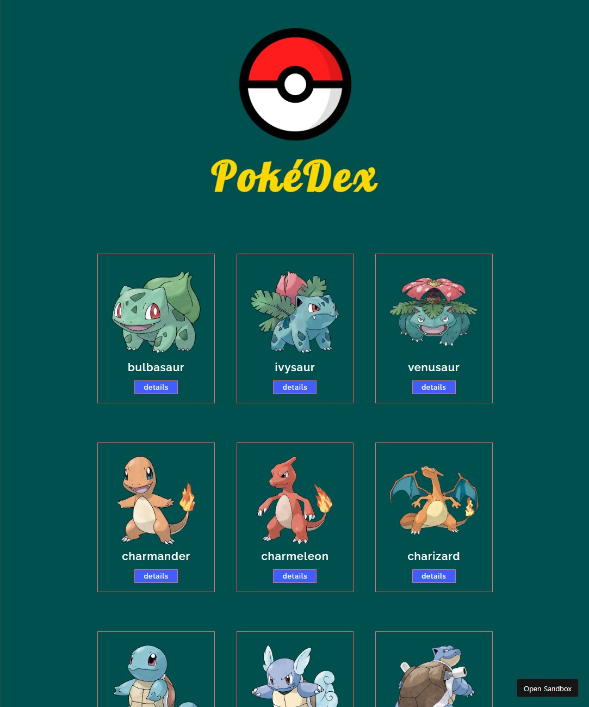
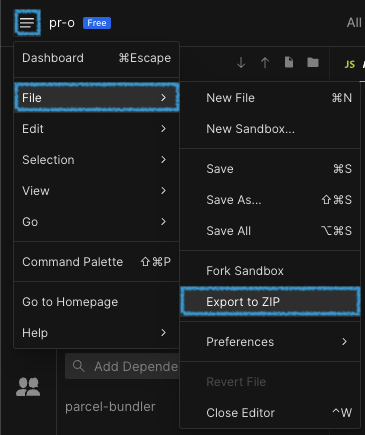

# 4장 실습: PokéDex - Part 1

학습한 내용을 실습해봅시다. HTML, CSS, JavaScript 코드를 조합해 다음과 같은 포켓몬 도감 웹사이트인 PokéDex 페이지를 만들어보겠습니다.





쉽게 개발을 시작할 수 있도록 기초적인 구조를 갖춘 boilerplate 프로젝트가 [CodeSandBox](https://codesandbox.io/s/starter-pokedex-example-html-css-javascript-leht07) 에 준비되어 있습니다. 이를 바탕으로 요구사항들을 순서대로 하나씩 구현해 넣다 보면 금방 완성할 수 있을 겁니다. 위 링크로 이동한 후, 다음의 두 가지 방식 중 하나를 택해서 프로젝트를 시작하세요.

1. 프로젝트를 우측 상단의 `Fork` 버튼을 눌러 `나의 CodeSandbox`로 가져와서 진행
2. 좌측 상단의 메뉴 버튼을 클릭한 후, `File → Export to ZIP` 메뉴를 클릭해 다운로드해서 VSCode와 같은 IDE에서 진행




## 디렉토리 구조

먼저, 프로젝트의 디렉토리 구조는 다음과 같습니다.

```
/pokeDex
│
├── assets
│   └── pokeBall-icon.png
├── src
│ ├── index.js
│ └── styles.css
├── index.html
└── package.json
```


**`index.html`**은 프로젝트 디렉토리의 바로 아래에 위치하고, **`index.js`**, **`styles.css`** 파일들은 `src` 디렉토리 안에 위치하고 있습니다. 마지막으로 이미지 파일은 `assets` 디렉토리 안에 위치합니다. `package.json` 파일은 무시하세요. 실제로 이 파일을 삭제하더라도 우리의 웹페이지는 잘 동작합니다.


## boilerplate 톺아보기

### HTML

```html
<!DOCTYPE html>
<html>
  <head>
    <title>PokéDex</title>
    <meta charset="UTF-8">
    <meta http-equiv="X-UA-Compatible" content="IE=edge">
    <meta name="viewport" content="widtjah=device-width, initial-scale=1.0">
    <link rel="stylesheet" type="text/css" href="src/styles.css">
    <link rel="stylesheet" type="text/css" href="<https://fonts.googleapis.com/css?family=Lobster&display=swap>"></link>
    <link rel="stylesheet" type="text/css" href="<https://fonts.googleapis.com/css2?family=Raleway:wght@200;600;800&display=swap>"></link>
  </head>
  <body>

    <main>

      <header>
        </img>
        <div class="title">PokéDex</div>
      </header>

      <ul id="pokemon-list"></ul>

    </main>

    <script src="./src/index.js"></script>
  </body>
</html>
```

****

**inside the \<head> tag**

세가지 요소로 구성되어있는 모습입니다.

* `<title>`: 문서 제목 요소
* `<meta>`: 메타데이터 요소
* `<link>`: 외부 리소스인 `src` 디렉토리 내의 CSS 파일과 [Google Fonts API](https://fonts.google.com/)가 제공하는 `Lobster` 그리고 `Raleway` 웹 폰트를 불러옵니다


**inside the \<body> tag**

크게 세개의 요소로 구성되어있습니다.

* `main`: 주요 콘텐츠를 정의하는 요소
* `header`: 로고 이미지와 페이지 제목을 포함하는 상단 헤더 요소
* `ul`: 포켓몬들의 리스트 항목들을 담을 리스트 요소
* `script`: 스크립트 요소로 `src` 디렉토리 내의 자바스크립트 코드를 불러옵니다


### CSS

```css
*,
*::before,
*::after {
  box-sizing: border-box;
}

* {
  font-family: "Raleway", sans-serif;
  font-weight: 600;
  letter-spacing: 1px;
}

body {
  height: 100vh;
  width: 70%;
  margin: 0 auto;
  display: flex;
  flex-direction: column;
  align-items: center;
  background-color: #005050;
  color: #fff;
}

main {
  padding-top: 5rem;
  padding-bottom: 15rem;
}

header {
  display: flex;
  flex-direction: column;
  justify-content: center;
  align-items: center;
  margin-bottom: 4rem;
}

.title {
  font-family: Lobster;
  font-size: 4.75rem;
  font-weight: 700;
  letter-spacing: 6px;
  color: #ffd700;
}

.pokeball-logo {
  width: 240px;
  height: 240px;
}

.header {
  font-family: Lobster;
  font-size: 4.75rem;
  font-weight: 700;
  color: #ffd700;
}
```


최소한의 CSS rules만 정의되어 있는 모습입니다. 웹 페이지를 완성하는데 필요한 나머지 스타일은 프로젝트를 진행하면서 정의해줘야 합니다.


### JavaScript

```javascript
const ulElement = 0;

renderFunction(ulElement);

function getImageURI(id) {
  // 이 함수는 그대로 사용하면 됩니다
  return (
    `https://raw.githubusercontent.com/PokeAPI/sprites/master/` +
    `sprites/pokemon/other/official-artwork/${id}.png`
  );
}

function getPokemonList() {
  const url = "<https://pokeapi.co/api/v2/pokemon?limit=151>";
  return 0;
}

function renderFunction(parentElement) {
  // getPokemonList().then();
}
```


개발 가이드로서 사용할 수 있는 최소한의 코드가 작성되어있습니다.


## 요구사항

1. `<ul>` 요소를 선택해 `ulElement` 변수에 할당해주세요.
2. `getPokemonList` 함수를 완성해주세요. 이 함수는 `fetch API`를 사용해 `url` 변수 내 URL로 GET 요청을 보낸 후, 받은 응답을 JSON으로 변환하는 promise를 반환해주어야 합니다. 완성된 함수는 `renderFunction` 함수 안에서 호출될 겁니다. ([fetch API docs](https://developer.mozilla.org/en-US/docs/Web/API/Fetch\_API/Using\_Fetch))
3. `<ul>` 요소에 대한 CSS 스타일을 정의해서 자식들인 `<li>` 요소들의 앞에 bulletpoint가 생기지 않도록 해주세요. 또, `display` attribute을 수정해 자식 요소들이 한 줄(row)에 하나가 아니라 셋씩 배치되도록 해주세요.
4. `renderFunction` 함수를 완성해주세요. 이 함수는 xx번 라인에서 위에서 완성한 `getPokemonList` 함수를 호출하고, 반환된 promise에 `.then()` 함수를 사용해 promise chain을 형성하고 있습니다. 이 promise chain의 두번째 promise는 `getPokemonList` 함수로 불러온 데이터 배열을 순회하며 각 (포켓몬) 항목마다 다음을 반복수행해야 합니다.
   * [ ] `span` 요소 생성, 내부 텍스트에 포켓몬 이름을 삽입
   * [ ] `img` 요소 생성, `src` attribute을 포켓몬 이미지 URL로 지정 (`getImageURI` 함수 사용)
   * [ ] `img` 요소의 `className` attribute을 지정해서 CSS style 정의
   * [ ] `div` 요소 생성, `className` attribute을 지정하고 CSS style 정의
   * [ ] 위에서 생성한 `span`, `img` 요소들을 `div` 요소의 자식으로 삽입
   * [ ] `li` 요소 생성, `div` 요소를 `li` 요소의 자식으로 삽입
   * [ ] `li` 요소를 `parentElement`의 자식으로 삽입


<details>

<summary>힌트 1</summary>

[MDN - Using Promises](https://developer.mozilla.org/en-US/docs/Web/JavaScript/Guide/Using\_promises)

</details>

<details>

<summary>힌트 2</summary>

`list-style-type: none`

</details>

<details>

<summary>힌트 3</summary>

`display: flex` ([docs](https://developer.mozilla.org/en-US/docs/Web/CSS/flex)) / `display: grid` ([docs](https://developer.mozilla.org/en-US/docs/Web/CSS/grid))

</details>

<details>

<summary>힌트 4</summary>

`document.createElement()`

</details>

<details>

<summary>힌트 5</summary>

`element.appendChild()`

</details>


### 🎉 완성 🎉

요구사항을 모두 구현했다면 `PokéDex` 페이지가 어느정도 완성되었을 겁니다. Part 2에서 만나요 👋

완성된 프로젝트의 코드는 실습 Part 2에서 참고할 수 있습니다.

