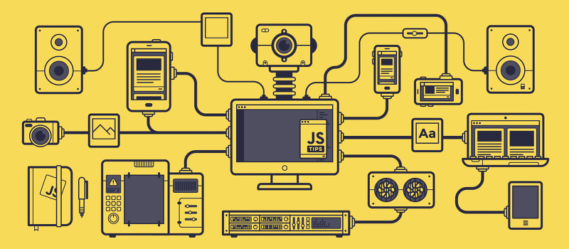
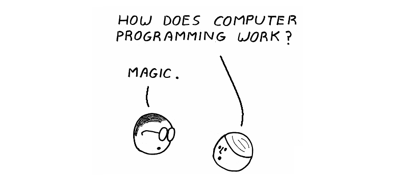

# 소개

<figure><figcaption></figcaption></figure>

자바스크립트는 객체지향형 스크립트 언어로 웹 브라우저 내에서 주로 사용되지만, [Node.js](https://nodejs.org/en/about/)와 같은 런타임 환경과 같이 서버 개발에서도 사용되고 있습니다. [W3Techs](https://w3techs.com/technologies/details/cp-javascript)에 따르면 전세계 웹사이트들의 98%가 자바스크립트를 사용하고 있습니다. 웹 뿐만 아니라 우리에게 친숙한 [Slack](https://slack.com/), [Notion](https://www.notion.so/), [Discord](https://discord.com/), [VSCode ](https://code.visualstudio.com/)등의 데스크탑 앱들도 실은 자바스크립트로 만들어졌습니다.

  <mark style="color:#ff625acc;">Superb AI - Lunch & Learn - JavaScript 강의 자료 (2022.08.02 ~ 2022.08.30)</mark>

